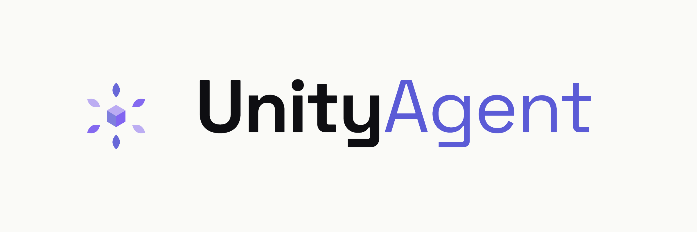

<picture>
  <source media="(prefers-color-scheme: dark)" srcset="docs/assets/unityagent-dark.png">
  
</picture>

### VRChat アバター制作特化の AI Unity Editor エージェント

自然言語で Unity Editor を操作 — VRChat アバター向けの **400+ ツール**を搭載。

[**🌐 公式サイト**](https://lighfu.github.io/unity-agent/) · [**📦 Releases**](https://github.com/lighfu/unity-agent/releases) · [**🧩 VPM リポジトリ**](https://lighfu.github.io/vpm/)

[English](README.md) · **日本語** · [繁體中文](README.zh-TW.md) · [简体中文](README.zh-CN.md)

---

## ✨ 主な機能

| | |
|---|---|
| 🗣️ **自然言語で操作** | チャットで Unity Editor を操作 — エージェントが 400+ の専用ツールを呼び出します。 |
| 🧍 **アバター必須設定** | 視点(Viewpoint) / Eye Look / Viseme、PhysBone・Contact・Constraint、表情メニュー＆パラメータ。 |
| 🧩 **非破壊ワークフロー** | Modular Avatar / NDMF / VRCFury を本格サポート(Merge Animator/Armature、Bone Proxy、入れ子メニュー…)。 |
| 😀 **表情・アニメーション** | FaceEmo 表情、AnimationClip / Animator / AnimatorAsCode 作成。 |
| 🎨 **メッシュ・マテリアル・テクスチャ** | メッシュ/UV/BlendShape/ウェイト編集、lilToon、さらに **AI テクスチャ生成(img2img)**。 |
| 📱 **Quest・パフォーマンス** | 最適化、パフォーマンスランク診断、Quest 変換補助。 |
| 🔌 **MCP サーバー** | ツールを Model Context Protocol で公開し、外部クライアント(例: Claude Code)から Unity を操作可能。 |
| 🌍 **多言語 UI** | 日本語 / English / 繁體中文 / 简体中文。 |

### 🤖 対応プロバイダー

| 種類 | プロバイダー |
|---|---|
| **LLM** | Anthropic Claude · OpenAI · Google Gemini(Vertex AI 含む) · OpenAI 互換エンドポイント · Claude / Codex / Gemini **CLI** |
| **画像(テクスチャ生成)** | Google Gemini · OpenAI · **ComfyUI**(ローカル img2img) |

### 🔗 連携(インストール時に自動検出)

Modular Avatar · NDMF · VRCFury · Avatar Optimizer (AAO) · lilToon · FaceEmo · VRCQuestTools · AnimatorAsCode · BlendShape Modifier · NDMF Mesh Simplifier · Gesture Manager · TexTransTool

---

## 概要

**UnityAgent** は、LLM(大規模言語モデル)を活用して Unity Editor を自然言語で操作できる AI エージェントです。VRChat アバター制作に特化した **400 以上のツール**を搭載し、「ボディに服を非破壊で着せて」「表情メニューにトグルを追加して」といった指示を実際の Editor 操作に変換します。

## インストール

### ALCOM / VCC 経由(推奨)

1. [VPM リポジトリ](https://lighfu.github.io/vpm/) を ALCOM / VCC に追加
2. プロジェクトに **UnityAgent** を追加

### 手動インストール

[Releases](https://github.com/lighfu/unity-agent/releases) から最新の zip をダウンロードし、`Packages/` フォルダに展開してください。

## 使い方

1. Unity メニュー **`Tools ▸ UnityAgent`** からエージェントウィンドウを開く
2. 設定で LLM プロバイダーと API キーを入力(Claude / OpenAI / Gemini / ローカル CLI 等)
3. チャットで自然言語で指示 → エージェントがツールを呼び出して Editor を操作
4. *(任意)* AI テクスチャ生成を使うなら画像プロバイダー(Gemini / OpenAI / ComfyUI)も設定

> 破壊的な操作(削除など)は実行前に確認ダイアログが表示されます。

## 依存・必要要件

- Unity **2022.3** 以降
- [MD3 SDK](https://github.com/lighfu/unity-md3sdk)(UI コンポーネント)
- VRChat SDK(`com.vrchat.avatars`)

## リンク

[公式サイト](https://lighfu.github.io/unity-agent/) · [Releases](https://github.com/lighfu/unity-agent/releases) · [VPM リポジトリ](https://lighfu.github.io/vpm/)

## ライセンス

MIT License — 詳細は [LICENSE](LICENSE) を参照してください。

---

VRChat クリエイターのために · 🤝 Claude (Anthropic) と共同開発 · © AjisaiFlow — MIT

